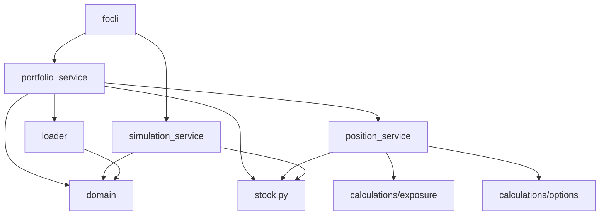

# Folib Implementation Status and Plan

This document captures the current implementation status of the folib library and outlines the plan for completing the remaining components. It serves as an extension and evolution of the original [master plan](master-plan-concise.md).

## Current Architecture

The folib library follows a layered architecture with clear separation of concerns:

```
src/
├── folib/                     # The core library
│   ├── domain.py              # Data classes (Position, Portfolio, etc.)
│   ├── calculations/          # Pure calculation functions
│   │   ├── exposure.py        # Exposure calculations
│   │   ├── options.py         # Option pricing and Greeks
│   ├── data/                  # Data access layer
│   │   ├── stock.py           # Market data access
│   │   ├── loader.py          # Portfolio loading
│   ├── services/              # Orchestration layer
│       ├── portfolio_service.py # Portfolio processing
│       ├── position_service.py  # Position analysis
│       ├── simulation_service.py # Portfolio simulation (stub)
```

### Key Components and Interactions

1. **Domain Layer (`domain.py`)**
   - Contains immutable data classes: `Position`, `StockPosition`, `OptionPosition`, etc.
   - Provides the core data structures used throughout the library
   - No business logic, just data representation

2. **Calculation Layer (`calculations/`)**
   - Pure functions with no side effects
   - Takes inputs as parameters, returns calculated values
   - No dependencies on other modules except domain classes
   - Key modules:
     - `exposure.py`: Functions for calculating market exposure
     - `options.py`: Functions for option pricing and Greeks using QuantLib

3. **Data Layer (`data/`)**
   - Handles external data access
   - `stock.py`: Provides market data (prices, betas, etc.) via `StockOracle`
   - `loader.py`: Loads portfolio data from CSV files

4. **Service Layer (`services/`)**
   - Orchestrates the lower layers to fulfill specific use cases
   - `portfolio_service.py`: Processes raw portfolio data into structured portfolios
   - `position_service.py`: Analyzes individual positions using calculation functions
   - `simulation_service.py`: Simulates portfolio performance (currently stub functions)

### Class Interactions



## Implementation Status

| Module | Status | Progress | Notes |
|--------|---------|-----------|-------|
| `domain.py` | ✅ DONE | 100% | Core data models implemented |
| `calculations/options.py` | ✅ DONE | 100% | Pure functions with direct QuantLib integration |
| `calculations/exposure.py` | ✅ DONE | 100% | All exposure calculations implemented |
| `data/stock.py` | ✅ DONE | 100% | Using existing implementation |
| `data/loader.py` | ✅ DONE | 100% | CSV loading and parsing complete |
| `services/position_service.py` | ✅ DONE | 100% | Position analysis complete |
| `services/portfolio_service.py` | ✅ DONE | 100% | Fully integrated with calculation modules |
| `services/simulation_service.py` | 🟡 PLANNED | 20% | Stub functions created |
| CLI Integration | ✅ DONE | 100% | Successfully integrated with focli |

## Current Implementation Details

### Domain Layer

The domain layer uses frozen dataclasses for immutability and type safety:

- `Position`: Base class with common fields (ticker, quantity, price)
- `StockPosition`, `OptionPosition`, `CashPosition`, `UnknownPosition`: Specialized position types
- `Portfolio`: Container for positions with helper properties
- `PortfolioSummary`: Summary metrics for a portfolio
- `ExposureMetrics`: Container for exposure calculations

### Calculation Layer

The calculation layer follows functional programming principles:

- `calculate_stock_exposure`: Calculates market exposure for stock positions
- `calculate_option_exposure`: Calculates market exposure for option positions
- `calculate_beta_adjusted_exposure`: Adjusts exposure by beta
- `calculate_option_delta`, `calculate_option_price`: Option Greeks and pricing
- `aggregate_exposures`: Aggregates multiple exposures with optional weights

### Service Layer

The service layer orchestrates the lower layers:

- `position_service.py`: Analyzes individual positions using the calculation functions
- `portfolio_service.py`: Processes raw portfolio data and calculates portfolio-level metrics

## Implementation Plan

### Phase 1: Portfolio Service Integration (✅ COMPLETED)

The portfolio service has been successfully integrated with the calculation modules:

1. **Updated `create_portfolio_summary`**
   - Replaced direct calculation of stock exposure with `calculate_stock_exposure`
   - Added option exposure calculation using `calculate_option_exposure` and `calculate_option_delta`
   - Used `calculate_beta_adjusted_exposure` for beta adjustments

2. **Updated `get_portfolio_exposures`**
   - Replaced direct calculation of stock exposure with `calculate_stock_exposure`
   - Added delta-adjusted option exposure using `calculate_option_exposure`
   - Used `calculate_beta_adjusted_exposure` for beta adjustments

### Phase 2: CLI Integration (✅ COMPLETED)

The folib library has been successfully integrated with the CLI application:

1. **Updated CLI to Use folib**
   - Replaced direct calls to old modules with calls to folib services
   - Updated data structures to use folib domain classes
   - Implemented portfolio loading using folib's data loader and portfolio service
   - Updated portfolio summary and listing commands to use folib's portfolio service
   - Updated position analysis commands to use folib's position service

2. **Added Backward Compatibility**
   - Maintained backward compatibility with existing CLI workflows
   - Added fallback mechanisms for handling errors in folib processing
   - Enhanced error handling and logging

### Phase 3: Simulation Service Implementation (🟡 PLANNED)

The next step is to implement the simulation service:

1. **Implement Core Simulation Functions**
   - `simulate_portfolio`: Simulate portfolio performance across different market scenarios
   - `generate_spy_changes`: Generate a range of SPY price changes for simulation
   - Leverage the calculation modules for accurate position pricing in different scenarios

2. **Add Position-Level Simulation**
   - Implement stock simulation using beta
   - Implement option simulation using delta and other Greeks

## Evolution from Original Plan

The implementation has evolved from the original master plan in several ways:

1. **Addition of Position Service**
   - The original plan didn't explicitly include a position service
   - Added to bridge the gap between calculation functions and portfolio-level services
   - Provides a clean interface for analyzing individual positions

2. **Enhanced Exposure Calculations**
   - More sophisticated exposure calculations than originally planned
   - Better handling of option exposures using delta
   - Support for beta-adjusted exposures

3. **Simplified Portfolio Structure**
   - Moved away from nested `PortfolioGroup` structure
   - Using flat list of positions with helper functions for grouping
   - More flexible and easier to work with

4. **Improved Error Handling**
   - More consistent error handling throughout the library
   - Better validation of inputs
   - Clear error messages

## Next Steps

1. **Implement Portfolio V2 Interface**
   - Create a new version of the portfolio interface that doesn't require backward compatibility
   - Simplify the data structures and APIs
   - Improve error handling and validation
   - Add comprehensive documentation

2. **Enhance CLI with V2 Interface**
   - Create new CLI commands that use the V2 interface
   - Provide better error messages and user feedback
   - Add more advanced filtering and sorting options
   - Improve the display of portfolio and position information

3. **Implement Simulation Service**
   - Implement core simulation functions
   - Add tests for simulation functions
   - Integrate simulation service with CLI

## Conclusion

The folib library has made significant progress, with all core components implemented and successfully integrated with the CLI application. The focus now shifts to creating a cleaner, more streamlined V2 interface that doesn't require backward compatibility with the old implementation.

The architecture has evolved from the original plan to be more flexible and maintainable, with clearer separation of concerns and better error handling. The addition of the position service provides a clean interface between the calculation functions and the portfolio-level services.

By implementing the V2 interface, we can further improve the user experience and code quality without the constraints of backward compatibility. This will allow for more innovative features and better performance, while still maintaining the core functionality that users rely on.

The simulation service implementation remains a priority and will be developed in parallel with the V2 interface. This will provide users with powerful tools for analyzing portfolio risk and performance under different market scenarios.
