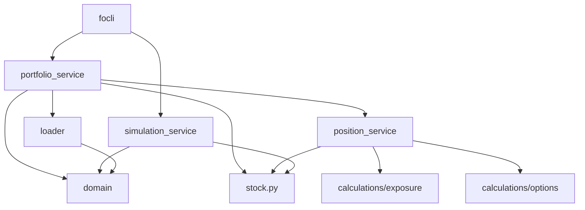

# Folib Implementation Status and Plan

This document captures the current implementation status of the folib library and outlines the plan for completing the remaining components. It serves as an extension and evolution of the original [master plan](master-plan-concise.md).

## Current Architecture

The folib library follows a layered architecture with clear separation of concerns:

```
src/
├── folib/                     # The core library
│   ├── domain.py              # Data classes (Position, Portfolio, etc.)
│   ├── calculations/          # Pure calculation functions
│   │   ├── exposure.py        # Exposure calculations
│   │   ├── options.py         # Option pricing and Greeks
│   ├── data/                  # Data access layer
│   │   ├── stock.py           # Market data access
│   │   ├── loader.py          # Portfolio loading
│   ├── services/              # Orchestration layer
│       ├── portfolio_service.py # Portfolio processing
│       ├── position_service.py  # Position analysis
│       ├── simulation_service.py # Portfolio simulation (stub)
```

### Key Components and Interactions

1. **Domain Layer (`domain.py`)**
   - Contains immutable data classes: `Position`, `StockPosition`, `OptionPosition`, etc.
   - Provides the core data structures used throughout the library
   - No business logic, just data representation

2. **Calculation Layer (`calculations/`)**
   - Pure functions with no side effects
   - Takes inputs as parameters, returns calculated values
   - No dependencies on other modules except domain classes
   - Key modules:
     - `exposure.py`: Functions for calculating market exposure
     - `options.py`: Functions for option pricing and Greeks using QuantLib

3. **Data Layer (`data/`)**
   - Handles external data access
   - `stock.py`: Provides market data (prices, betas, etc.) via `StockOracle`
   - `loader.py`: Loads portfolio data from CSV files

4. **Service Layer (`services/`)**
   - Orchestrates the lower layers to fulfill specific use cases
   - `portfolio_service.py`: Processes raw portfolio data into structured portfolios
   - `position_service.py`: Analyzes individual positions using calculation functions
   - `simulation_service.py`: Simulates portfolio performance (currently stub functions)

### Class Interactions



## Implementation Status

| Module | Status | Progress | Notes |
|--------|---------|-----------|-------|
| `domain.py` | ✅ DONE | 100% | Core data models implemented |
| `calculations/options.py` | ✅ DONE | 100% | Pure functions with direct QuantLib integration |
| `calculations/exposure.py` | ✅ DONE | 100% | All exposure calculations implemented |
| `data/stock.py` | ✅ DONE | 100% | Using existing implementation |
| `data/loader.py` | ✅ DONE | 100% | CSV loading and parsing complete |
| `services/position_service.py` | ✅ DONE | 100% | Position analysis complete |
| `services/portfolio_service.py` | 🟡 IN PROGRESS | 80% | Needs integration with calculation modules |
| `services/simulation_service.py` | 🟡 PLANNED | 20% | Stub functions created |
| CLI Integration | 🟡 PLANNED | 0% | Not started |

## Current Implementation Details

### Domain Layer

The domain layer uses frozen dataclasses for immutability and type safety:

- `Position`: Base class with common fields (ticker, quantity, price)
- `StockPosition`, `OptionPosition`, `CashPosition`, `UnknownPosition`: Specialized position types
- `Portfolio`: Container for positions with helper properties
- `PortfolioSummary`: Summary metrics for a portfolio
- `ExposureMetrics`: Container for exposure calculations

### Calculation Layer

The calculation layer follows functional programming principles:

- `calculate_stock_exposure`: Calculates market exposure for stock positions
- `calculate_option_exposure`: Calculates market exposure for option positions
- `calculate_beta_adjusted_exposure`: Adjusts exposure by beta
- `calculate_option_delta`, `calculate_option_price`: Option Greeks and pricing
- `aggregate_exposures`: Aggregates multiple exposures with optional weights

### Service Layer

The service layer orchestrates the lower layers:

- `position_service.py`: Analyzes individual positions using the calculation functions
- `portfolio_service.py`: Processes raw portfolio data and calculates portfolio-level metrics

## Implementation Plan

### Phase 1: Complete Portfolio Service Integration (Current Focus)

The immediate focus is to integrate the calculation modules into `portfolio_service.py` for better exposure calculations:

1. **Update `create_portfolio_summary`**
   - Replace direct calculation of stock exposure with `calculate_stock_exposure`
   - Add option exposure calculation using `calculate_option_exposure` and `calculate_option_delta`
   - Use `calculate_beta_adjusted_exposure` for beta adjustments

2. **Update `get_portfolio_exposures`**
   - Replace direct calculation of stock exposure with `calculate_stock_exposure`
   - Add delta-adjusted option exposure using `calculate_option_exposure`
   - Use `calculate_beta_adjusted_exposure` for beta adjustments

### Phase 2: Simulation Service Implementation

After completing the portfolio service integration, the next step is to implement the simulation service:

1. **Implement Core Simulation Functions**
   - `simulate_portfolio`: Simulate portfolio performance across different market scenarios
   - `generate_spy_changes`: Generate a range of SPY price changes for simulation
   - Leverage the calculation modules for accurate position pricing in different scenarios

2. **Add Position-Level Simulation**
   - Implement stock simulation using beta
   - Implement option simulation using delta and other Greeks

### Phase 3: CLI Integration

The final phase is to integrate the folib library with the CLI application:

1. **Update CLI to Use folib**
   - Replace direct calls to old modules with calls to folib services
   - Update data structures to use folib domain classes

2. **Add New CLI Commands**
   - Add commands for portfolio analysis
   - Add commands for position analysis
   - Add commands for portfolio simulation

## Evolution from Original Plan

The implementation has evolved from the original master plan in several ways:

1. **Addition of Position Service**
   - The original plan didn't explicitly include a position service
   - Added to bridge the gap between calculation functions and portfolio-level services
   - Provides a clean interface for analyzing individual positions

2. **Enhanced Exposure Calculations**
   - More sophisticated exposure calculations than originally planned
   - Better handling of option exposures using delta
   - Support for beta-adjusted exposures

3. **Simplified Portfolio Structure**
   - Moved away from nested `PortfolioGroup` structure
   - Using flat list of positions with helper functions for grouping
   - More flexible and easier to work with

4. **Improved Error Handling**
   - More consistent error handling throughout the library
   - Better validation of inputs
   - Clear error messages

## Next Steps

1. **Complete Portfolio Service Integration**
   - Integrate calculation modules into `portfolio_service.py`
   - Add tests for the updated functions

2. **Implement Simulation Service**
   - Implement core simulation functions
   - Add tests for simulation functions

3. **Integrate with CLI**
   - Update CLI to use folib services
   - Add new CLI commands

## Conclusion

The folib library is well on its way to completion, with most of the core components already implemented. The focus now is on integrating the calculation modules into the portfolio service, implementing the simulation service, and finally integrating with the CLI application.

The architecture has evolved from the original plan to be more flexible and maintainable, with clearer separation of concerns and better error handling. The addition of the position service provides a clean interface between the calculation functions and the portfolio-level services.
